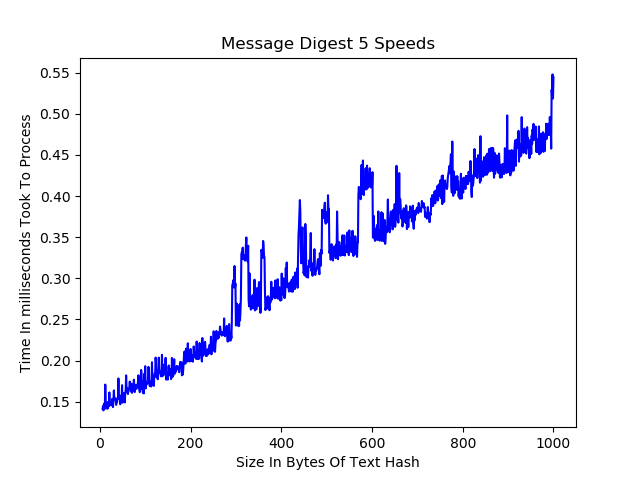
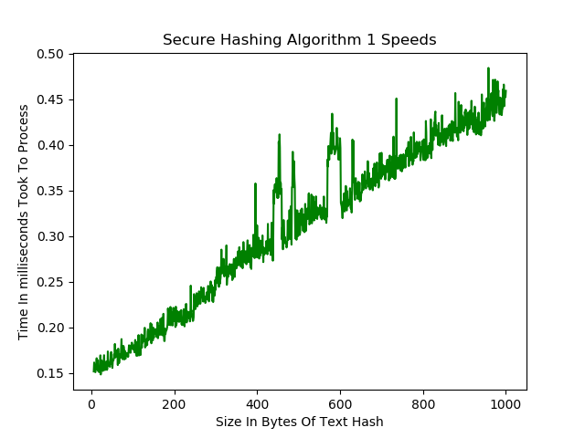
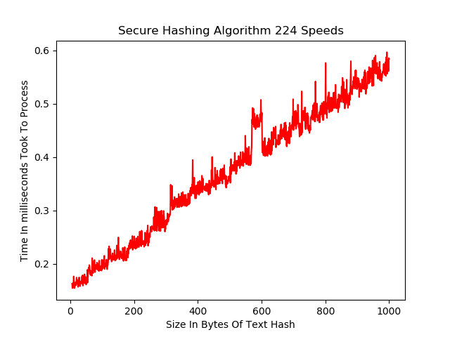
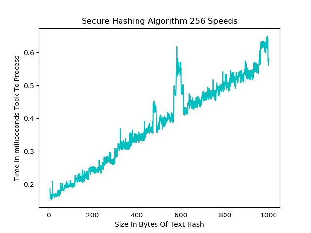
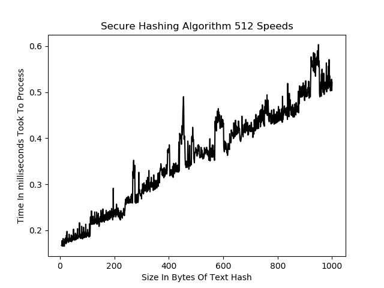

Cryptography
===

###Symmetric vs Asymmetric Systems
> ####Brief Introduction
>       Symmetric and Asymmetric refer to the keys used in the algorithm.
>    
>    
>       Symmetric - for all a, b in X if a is related to b then b is related to a.
>       Asymmetric - for every a, b pair in X if a is related to b then b is not related to a.

### Block vs Stream Encryption
> ####Brief Introduction
>       Block Encryption- When the data being encrypted is placed into blocks of a declared size
>           and padded to fill the room left avalible.
>       Strean Encryption- When the data being encrypted is in a one to one relation with with the 
>           output encrypted text.
>       
>       Block encryptions are better when being attact in the form of insertion. If a symbol is inserted
>           the entire block will be corrupted, and depending on the mode, as for the rest of the blocks
>           This can also be a downfall because if one character gets currupted the same will happen and 
>           all the data is lost.
>      Block encryptions are also slower since they typically have to wait for all the data to be blocked 
>           before begining as well the time spent on encrypting the padded data that wouldnt be there 
>           otherwise.
>       
>       Stream encryption is faster since time is not spent dealing with creation of the block as well as
>           the time saved by not encrypting unnecessary data from padding.
>       However stream encryption is not as secure as blocked since it is susceptible to insertion 
>           and modification attacks

### Advanced Encryption Standard ( AES )

> ####Brief Introduction
>
>     Encryption type: Symmetric
>     Original name: Rijndael ( dutch heritage )
>    
>     There are 3 Basic forms of aes;
>        > AES-128 which has 11 rounds
>        > AES-192 which has 13 rounds
>        > AES-256 which has 15 rounds
>    
>     There is then 5 different modes to encrypt with;
>         > Electronic Code Book ( ECB )
>         > Cipher Block Chaining ( CBC )
>         > Cipher Feedback ( CFB )
>         > Output  Feedback ( OFB )
>         > Counter ( CTR )
>
> #### Basic Encryption Steps
>
>        1. All data is placed within blocks that match the side of the earlier mentioned forms,
>            For example, AES-128 has a block size of 128 bytes
>                > These blocks are refered to as the state array
>                > They are the main focus of the encryption process
>                
>        2. Each byte is subsituted with an S-Box
>            > Substitution boxes are implicit, what may not be implicit is when one is presented with ROT##
>                ROT refers to the process of "shifting" letters.
>                    > ROT1 => A = B
>                    > ROT2 => A = C
>                    .
>                    .
>                    .
>                    >ROT25 => A => Z
>                
>        3. Row Shift
>            > Each row is rotated a pre-determined amount of bytes
>                In 128: 
>                    Row 1 is roteated right by 0 bytes
>                    Row 2 is roteated right by 1 bytes
>                    Row 3 is roteated right by 2 bytes
>                    Row 4 is roteated right by 3 bytes
>                        
>        4. Mix Columns
>            > Mix columns is the process that creates a new column in the state array
>            > This Column is created in a linear algebra equation
>     
>        5. Apply Row Keys
>            > This is where the key is applied to the state array
>            > The Row keys that where dirived from the original key are XOR'ed with the state array
>
>
> 
>
> ##### Mixed Columns
> 
             

### Rivest, Shamir and Adelman( RSA )
> #### Brief Introduction
>
>       RSA centers its focus around 2 major numbers, one called the modulus and the other called the exponent
>           when one see key's that look look like a jumbled mess it's due to the fact that
>           it is in a standard for with some type of encoding, but past that those peices of
>           data reside inside that cryptic text
>       RSA is a stream encryption
>
> ####Key Generation
>      
>       In order to encrypt anything in RSA encryption keys are required, due to its asymmetric
>           nature. The first key to be generated is the private key.
> > ##### Private Key Generation:
> >     1. Pick two numbers at random, but they must be prime, we will call these
> >         variables p and q
> >     
> >     2. From these two numbers we can compute the modulus (n)
> >             n = p * q 
> >     
> >     3. Following this the Euler's Totient Function is used to find the a number for 
> >         length of the set of numbers that are relivily prime to n. This is denoted as
> >         φ(n).
> >             φ(n) = ( q - 1 ) * ( p - 1 )
> > 
> >     4. lastly we find the exponent for the private key
> >             exponent = x where 1 < x < φ(n) and x is coprime to to the modulus
> > 
> > ##### Public Key Generation:
> >     
> >     1. The modulus is set to be the same as its private key equivelent
> >     
> >     2. The rule is set that 
> >             ( d * exponent ) % φ(n) = 1
> >     
> >     3. Using the exponent from the private key we can solve for d, there will
> >         be multiple anwers for this where the range is infinit. Any of the possiblities
> >         may be choosen.
> >
> >     4. Once choosen that number is set to the exponent of the public key.
>
> #### Encryption
> 
> >     1. The public key is obtained
> >
> >     3. Each byte(b) is then put into the following equation where e is its encrypted value
> >                 b^(exponent) % modulus = e
> >
> >     4. All the bytes are then placed together again and form a new byte array
> > 
> > 
>
> #### Decryption
> 
> >     1. The private key is obtained
> >
> >     2. The bytes(b) given in the encrypted text are put through the following equation just as before, where 
> >         d is the decrypted byte
> >                 b^(exponent) % modulus = d
> >
> >     4. All the bytes are then placed together again and form a new byte array that can then be turned
> >         turned into a decrypted string
>

## Data Encryption Standard ( DES )
> #### Brief Introduction
>       DES is a symmetric key algorithm, just like AES encryption.
>       In current time it is considered outdated, however still worth knowing some of its basics.
>       It was designed by IBM in the 70's and in the 1977's it was adopted as the United State's first
>           encryption algorithm
>       64 block encryption
>       The key was limited to 64 bits with 8 of the bits not activly being used to encrypt
>       "Easly" beaten with Brute force, it only takes a maximum of 2^(56) attempts to guess the key
    
## Data Encryption Standard 3( DES3 )
> #### Brief Introduction
>  
    
## Blowfish Encryption
> #### Brief Introduction
>      

Hashing
===

### Message Digest (MD)
> #### Brief Introduction
>
> >     Message digest is a form of hashing outputs 128 bits from any length string
> >     It works in a way much like AES encryption where the message is broken into blocks, 
> >         these blocks being the size of 32 bit words.
> >     Designed by Rivest, who also played a role in creating RSA
>
>
> #### Forms of Message Digest
> >     Hashed Message Authentication Code (HMAC)
> >     Message Digest 2 (MD2)
> >     Message Digest 4 (MD4)
> >     Message Digest 5 (MD5)
>
> #### Hashing Speed
> > 

### Secure Hashing Algorithms (SHA)
> #### Brief Introduction
> >     SHA was developed by the US and based off of the Message digest counter part, first published
> >         in 1993
>
> #### Forms Of Secure Hashing Algorithms
> >     Sha Forms are broken into groups called SHA-0, SHA-1, SHA-2, SHA-3
> >         > SHA-0 contains only SHA-0
> >         > SHA-1 contains only SHA-1
> >         > SHA-2 contains SHA-224, SHA-256, SHA-384, SHA-512, SHA-512/224, SHA-512/256
> >         > SHA-3 contains SHA-224, SHA-256, SHA-384, SHA-512, SHAKE128, SHAKE256
> >
> >     For more infromation about how each differs refer to the chart in the Wikipedia page 
> >         linked in the Helpful Links section
> #### Speeds
> > 
> > 
> > 
> > 
> > 

Helpful Links
===
> 
> #### Symmetric Vs Asymmetric Encryption
> > [Slides detailing Symmetric vs Asymmetric](https://www.cs.utexas.edu/users/byoung/cs361/lecture44.pdf)
>  
> #### Block vs Stream Encryption
> > [Slides detailing Block vs Stream](https://www.cs.utexas.edu/~byoung/cs361/lecture45.pdf)
>
> #### AES Encryption
> > [The Process](http://etutorials.org/Networking/802.11+security.+wi-fi+protected+access+and+802.11i/Appendixes/Appendix+A.+Overview+of+the+AES+Block+Cipher/Steps+in+the+AES+Encryption+Process/)
> >
> > [Logistics and history](https://searchsecurity.techtarget.com/definition/Advanced-Encryption-Standard)
> >
> > [Modes of Operation Of The AES Algorithm](http://ciit.finki.ukim.mk/data/papers/10CiiT/10CiiT-46.pdf)
> 
> #### RSA Encryption
> > [The Process](https://hackernoon.com/how-does-rsa-work-f44918df914b)
> > 
> > [The History](https://www.securityweek.com/understanding-public-key-cryptography-and-history-rsa)
> 
> #### DES Encryption
> > [The Process](https://www.tutorialspoint.com/cryptography/data_encryption_standard.htm)
> >
> > [Background](https://searchsecurity.techtarget.com/definition/Data-Encryption-Standard)
>
> #### DES3 Encryption
> > [Link Here]()
>
> #### Blowfish Encryption
> > [Everything about Blowfish](https://www.embedded.com/design/configurable-systems/4024599/Encrypting-data-with-the-Blowfish-algorithm)
>
> #### Hashing
> > [Wikipedia](https://en.wikipedia.org/wiki/Secure_Hash_Algorithms)
> >
> > [Extra Infromation about hashing](https://www.sans.edu/cyber-research/security-laboratory/article/hash-functions)