Cryptography
===

### Symmetric vs Asymmetric Systems

> #### Brief Introduction
>       Symmetric and Asymmetric refer to the keys used in the algorithm.
>    
>    
>       Symmetric - For all a, b in X if a is related to b then b is related to a.
>       Asymmetric - For every a, b pair in X if a is related to b then b is not related to a.

### Block vs Stream Encryption

> #### Brief Introduction
>       Block Encryption- When the data being encrypted is placed into blocks of a declared size
>           and padded to fill the room left available.
>       Stream Encryption- When the data being encrypted is in a one to one relation with with the 
>           output encrypted text.
>       
>       Block encryptions are better when being attact in the form of insertion. If a symbol is inserted
>           the entire block will be corrupted, and depending on the mode, as for the rest of the blocks
>           This can also be a downfall because if one character gets currupted the same will happen and 
>           all the data is lost.
>       Block encryptions are also slower since they typically have to wait for all the data to be blocked 
>           before begining as well the time spent on encrypting the padded data that wouldnt be there 
>           otherwise.
>       
>       Stream encryption is faster since time is not spent dealing with creation of the block as well as
>           the time saved by not encrypting unnecessary data from padding.
>       However stream encryption is not as secure as blocked since it is susceptible to insertion 
>           and modification attacks

### Modes of Operation

> #### Brief Introduction
>       Modes of Operation are mostly seen within block encryptions. there are five
>           modes including; 
>                 > Electronic Code Book ( ECB )
>                 > Cipher Block Chaining ( CBC )
>                 > Cipher Feedback ( CFB )
>                 > Output Feedback ( OFB )
>                 > Counter ( CTR )
>
> #### Electronic Code Book
>       ECB is one of the simplest modes, it reqires nothing more than the basics.
>           it does not support an intitial vector. With that being said it is also
>           the least safe modes since attackers can build up what is called a codebook
>           which is just a one to one map from encrypted text to decrypted text.
>        
> #### Cipher Block Chaining
>       CBC is easly put as, "A chain of encryption." Each block is used for the next
>           block as a key that XOR'ed with the plain text of that block. In order for
>           this to work though a initial vector is requred to be used as the first "block"
>           that will be XOR'ed with the true first block. For this to work properly the 
>           initial vector has to be discussed between the encryptor and the decryptor.
>

### Advanced Encryption Standard ( AES )

> #### Brief Introduction
>
>       Encryption type: Symmetric
>       Original name: Rijndael ( dutch heritage )
>    
>       There are 3 Basic forms of aes;
>          > AES-128 which has 10 rounds and 11 round keys
>          > AES-192 which has 12 rounds and 13 round keys
>          > AES-256 which has 14 rounds and 15 round keys
>
>       Each has an aditional round key to store the origional key itself
>
>       The State Array - When something refers to the block in a block encryption this is
>           typically what they are refering to. It is a array that is normally shown as a
>           two dimentional array and it is where the plain text is initially placed when 
>           recieved and furthermore acted on proceeding that step. In AES encryption it is
>           the center focus of the process.
>
>       The Substitution box - Often refered to as an s-box, it is without arguement the easiest
>           part of AES encryption. An s-box is just a map from one byte to another byte. Normally
>           we see thing like ROT followed by a integer from 1-25. ROT just means rotate and the 
>           number refers to the amount of places. Simply put if you have an 'A' and apply ROT1 to it
>           you get 'B' likewise if you have 'b' and apply ROT5 to it you get 'g'
>       
>       Round Constant - Rijndael key schedule is what defines what the round constant is with AES.
>           Often you will see it abreviated as 'rcon'. The rcon for AES is defined using finite numbers
>           which is a whole seperate topic, the only ones we need to know are 1 through 10 and we get
>           first 7 from the expression 2^(x), and the next ones are 8 -> 27, 9 -> 54, and 10->108.
>
>       Round Keys - This is the part where the key comes into place with AES encryption. There are x
>           amount of round keys where x is defined by the form of aes you are using. To have an example
>           well say we have a AES-128 equivelent key and we have 10 rounds that we need keys for. The first
>           step is to break the key into 4 32 but words and place them in the first key. For the next 10
>           10 keys we need to derive we will use the following formulas;
>                   > R(x) = x rotated right 8 bits
>                   > Key(i):W(0) = key(i-1):W(0) XOR R( key(i-1):W3 ) XOR Rcon[i]
>                   > key(i):W(i) = key(i-1):W(i) XOR Key(i):W(i-1)
>           after applying all of these equations to each 32 bit word that each row contains then the round 
>           keys are ready for use.
>
> #### Basic Encryption Steps
>
>        1. All data is placed within blocks that match the side of the earlier mentioned forms,
>            For example, AES-128 has a block size of 128 bytes
>                > These blocks are refered to as the state array
>                > They are the main focus of the encryption process
>                
>        2. Each byte is subsituted with an S-Box
>            > Substitution boxes are implicit, what may not be implicit is when one is presented with ROT##
>                ROT refers to the process of "shifting" letters.
>                    > ROT1 => A = B
>                    > ROT2 => A = C
>                    .
>                    .
>                    .
>                    >ROT25 => A => Z
>                
>        3. Row Shift
>            > Each row is rotated a pre-determined amount of bytes
>                In 128: 
>                    Row 1 is roteated right by 0 bytes
>                    Row 2 is roteated right by 1 bytes
>                    Row 3 is roteated right by 2 bytes
>                    Row 4 is roteated right by 3 bytes
>                        
>        4. Mix Columns
>            > Mix columns is the process that takes the state array and applys a linear 
>               algebra equation to create a new state array.
>     
>        5. Apply Row Keys
>            > This is where the key is applied to the state array
>            > The Row keys that where dirived from the original key are XOR'ed with the state array
>
>
> 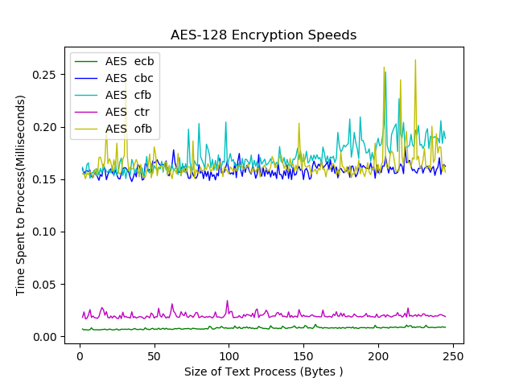
> 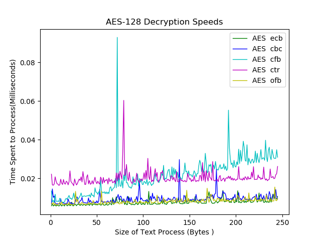
>
> ##### Mixed Columns
> 
             

### Rivest, Shamir and Adelman( RSA )
> #### Brief Introduction
>
>       RSA centers its focus around 2 major numbers, one called the modulus and the other called the exponent
>           when a key is normally seen it will look like a jumbled mess. This is due to the fact that
>           it's in a standardized form with some type of encoding, but beyond that it holds those two numbers
>       RSA is defined as a stream encryption, unlike its counterpart AES which is a block encryption
>       RSA is also defined as a ASymmetric encryption since it requires the use of two keys, public and private.
>       
>
> #### Key Generation
>      
>       In order to encrypt anything in RSA encryption keys are required, due to its asymmetric
>           nature. The first key to be generated is the private key.
> > ##### Private Key Generation:
> >     1. Pick two numbers at random, but they must be prime, we will call these
> >         variables p and q
> >     
> >     2. From these two numbers we can compute the modulus (n)
> >             n = p * q 
> >     
> >     3. Following this the Euler's Totient Function is used to find the length of the set 
> >         containing no common factors with n. This is denoted as φ(n).
> >             φ(n) = ( q - 1 ) * ( p - 1 )
> > 
> >     4. Lastly we find the exponent for the private key
> >             exponent = x where 1 < x < φ(n) and x is coprime to to the modulus
> > 
> > ##### Public Key Generation:
> >     
> >     1. The modulus is set to be the same as its private key equivelent
> >     
> >     2. The rule is set that 
> >             ( d * exponent ) % φ(n) = 1
> >     
> >     3. Using the exponent from the private key we can solve for d, there will
> >         be multiple answers for this where the range is infinit. Any of the possibilities 
> >         may be chosen.
> >
> >     4. Once choosen that number is set to the exponent of the public key.
>
> #### Encryption
> 
> >     1. The public key is obtained
> >
> >     2. Each byte(b) is then put into the following equation where e is its encrypted value
> >                 b^(exponent) % modulus = e
> >
> >     3. All the bytes are then placed together again and form a new byte array
> > 
> > 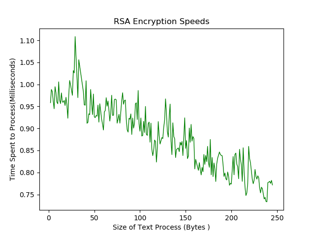
>
> #### Decryption
> 
> >     1. The private key is obtained
> >
> >     2. The bytes(b) given in the encrypted text are put through the following equation just as before, where 
> >         d is the decrypted byte
> >                 b^(exponent) % modulus = d
> >
> >     4. All the bytes are then placed together again and form a new byte array that can then be turned
> >         turned into a decrypted string
>

## Data Encryption Standard ( DES )
> #### Brief Introduction
>       DES is a symmetric key algorithm, just like AES encryption.
>       In current time it is considered outdated, however still worth knowing some of its basics.
>       It was designed by IBM in the 70's and in the 1977's it was adopted as the United State's first
>           encryption algorithm
>       64 block encryption
>       The key was limited to 64 bits with 8 of the bits not activly being used to encrypt
>       "Easly" beaten with Brute force, it only takes a maximum of 2^(56) attempts to guess the key
    
## Data Encryption Standard 3( DES3 )
> #### Brief Introduction
>       The reason it helps to have some background on DES encryption is because one of 
>           the standard encryption this day in age is 3DES. essentially it is the same 
>           thing as des ecept for it is encrypted 3 times with a different key each 
>           time. making the 56 bit key turn into a 168-bit key equivelent.
>  
> #### Speeds
> > 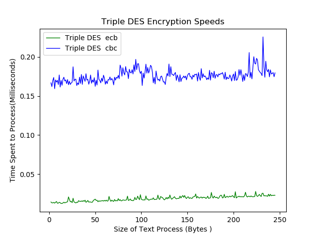
> > 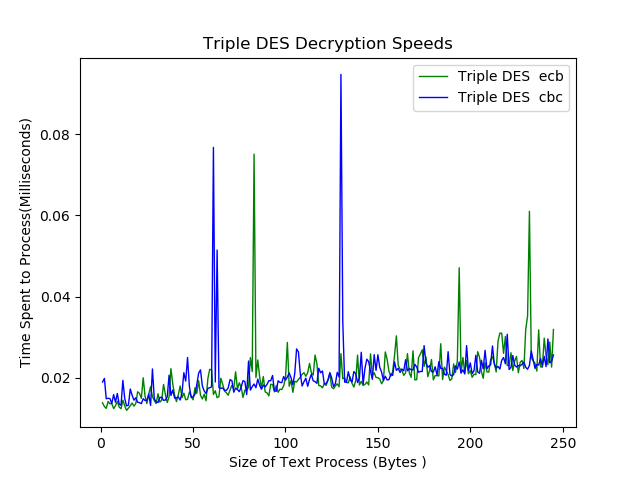

## Blowfish Encryption
> #### Brief Introduction
>       Blow fish is a rather unique encryption methods, it is said to be one of the 
>           fastest in regards to encryption and decryption but it is not without any
>           downfalls as well. Blowfish requires a rather large amount of prossesing
>           to be done when creating a key. But with that being said in situations where
>           a key is not being created often it is fairly widly used.
>       Blowfish was discoved in 1993 as a replacement for DES which at the time was suffering
>           from its clear vulnerabilities.
>       Still it appears lower on this list because it is rated as inferior to AES, but as
>           each of these encryptions there is a time and a place where this should be used
>      
> #### Speeds
> > 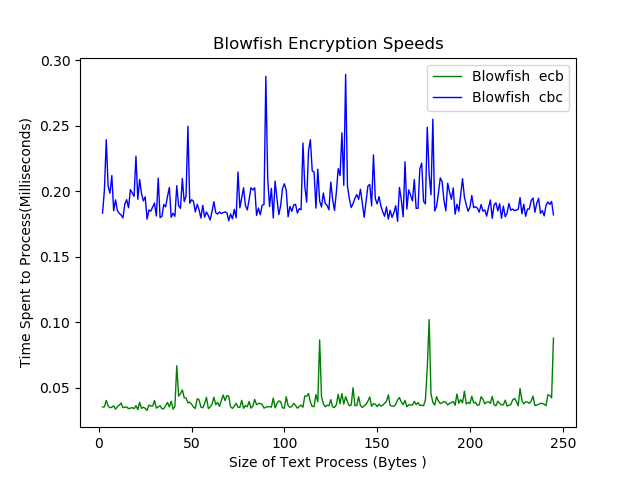
> > 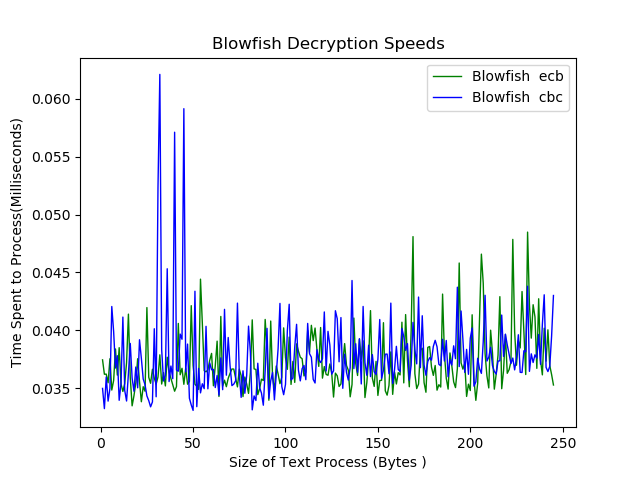

## Comparing Encryption
> #### Speeds
> > 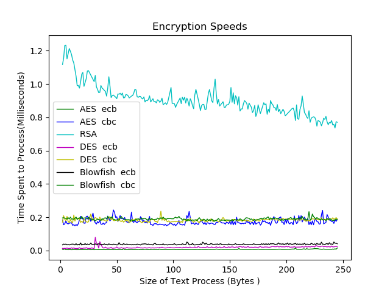
> > 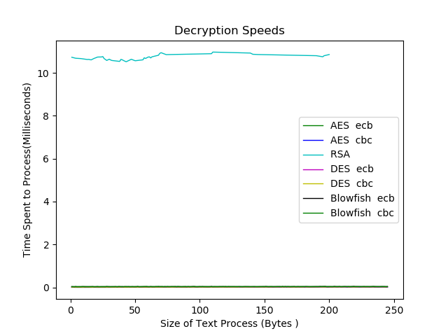
> > 
> > 
> > 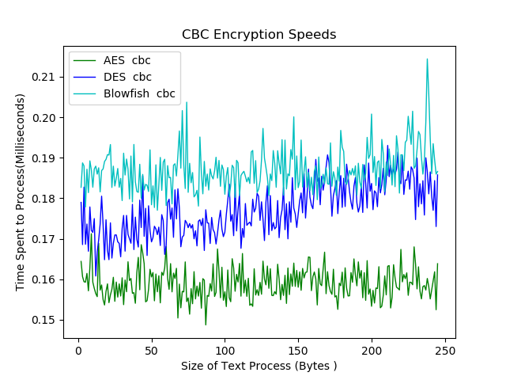
> > 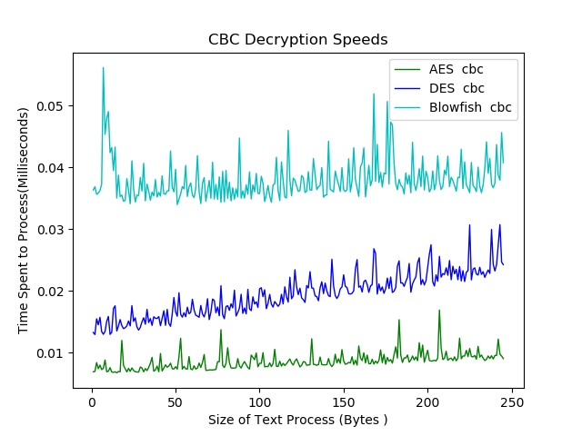

Hashing
===

### Message Digest (MD)
> #### Brief Introduction
>
> >     Message digest is a form of hashing outputs 128 bits from any length string
> >     It works in a way much like AES encryption where the message is broken into blocks, 
> >         these blocks being the size of 32 bit words.
> >     Designed by Rivest, who also played a role in creating RSA
>
>
> #### Forms of Message Digest
> >     Hashed Message Authentication Code (HMAC)
> >     Message Digest 2 (MD2)
> >     Message Digest 4 (MD4)
> >     Message Digest 5 (MD5)
>
> #### Hashing Speed
> > 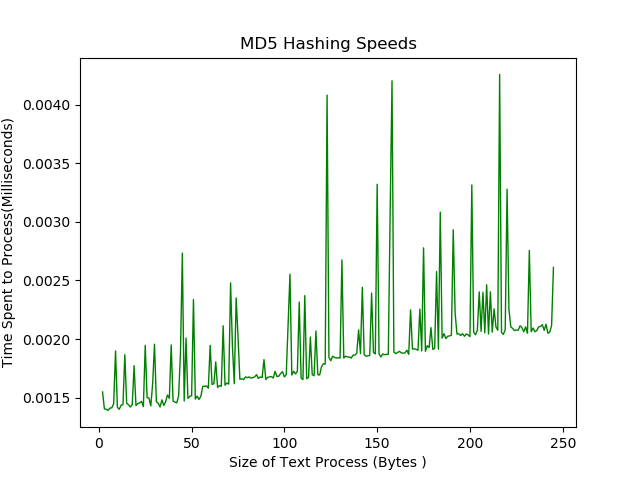

### Secure Hashing Algorithms (SHA)
> #### Brief Introduction
> >     SHA was developed by the US and based off of the Message digest counter part, first published
> >         in 1993
>
> #### Forms Of Secure Hashing Algorithms
> >     Sha Forms are broken into groups called SHA-0, SHA-1, SHA-2, SHA-3
> >         > SHA-0 contains only SHA-0
> >         > SHA-1 contains only SHA-1
> >         > SHA-2 contains SHA-224, SHA-256, SHA-384, SHA-512, SHA-512/224, SHA-512/256
> >         > SHA-3 contains SHA-224, SHA-256, SHA-384, SHA-512, SHAKE128, SHAKE256
> >
> >     For more infromation about how each differs refer to the chart in the Wikipedia page 
> >         linked in the Helpful Links section
> #### Speeds
> > 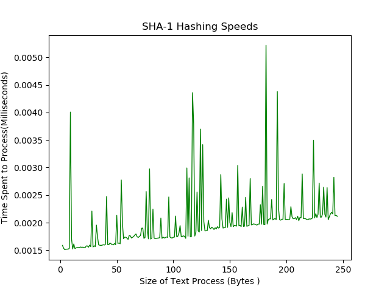
> > 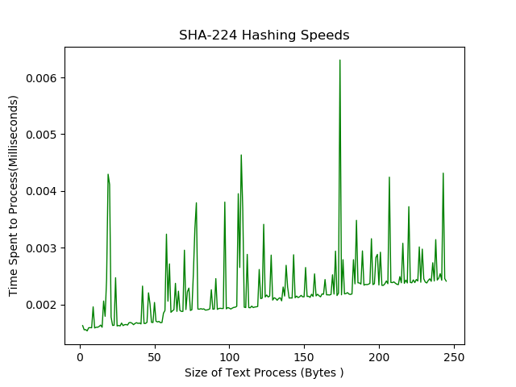
> > 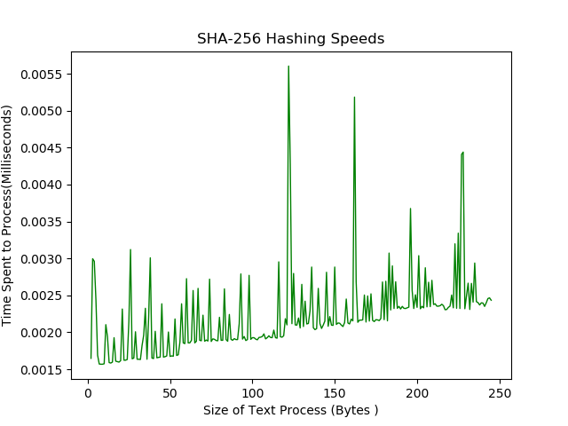
> > 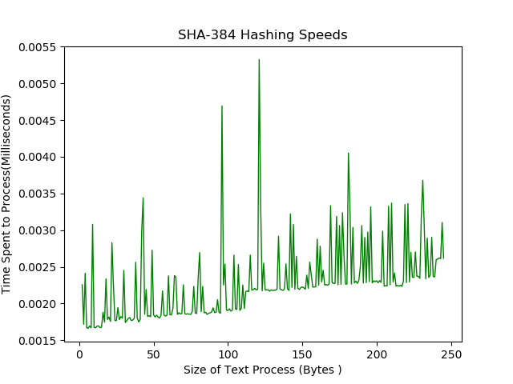
> > 

Helpful Links
===
> 
> #### Symmetric Vs Asymmetric Encryption
> > [Slides detailing Symmetric vs Asymmetric](https://www.cs.utexas.edu/users/byoung/cs361/lecture44.pdf)
>  
> #### Block vs Stream Encryption
> > [Slides detailing Block vs Stream](https://www.cs.utexas.edu/~byoung/cs361/lecture45.pdf)
>
> #### Modes of Operation
> > [Slides with information about block encryption](https://www.cs.columbia.edu/~smb/classes/s09/l05.pdf)
>
> #### AES Encryption
> > [The Process](http://etutorials.org/Networking/802.11+security.+wi-fi+protected+access+and+802.11i/Appendixes/Appendix+A.+Overview+of+the+AES+Block+Cipher/Steps+in+the+AES+Encryption+Process/)
> >
> > [Logistics and history](https://searchsecurity.techtarget.com/definition/Advanced-Encryption-Standard)
> >
> > [Modes of Operation Of The AES Algorithm](http://ciit.finki.ukim.mk/data/papers/10CiiT/10CiiT-46.pdf)
> 
> #### RSA Encryption
> > [The Process](https://hackernoon.com/how-does-rsa-work-f44918df914b)
> > 
> > [The History](https://www.securityweek.com/understanding-public-key-cryptography-and-history-rsa)
> 
> #### DES Encryption
> > [The Process](https://www.tutorialspoint.com/cryptography/data_encryption_standard.htm)
> >
> > [Background](https://searchsecurity.techtarget.com/definition/Data-Encryption-Standard)
>
> > [The Process Of DES](http://page.math.tu-berlin.de/~kant/teaching/hess/krypto-ws2006/des.htm)
>
> #### DES3 Encryption
> > [NIST Paper from 2012, Everything you need to know](https://nvlpubs.nist.gov/nistpubs/Legacy/SP/nistspecialpublication800-67r1.pdf)
>
> > [NIST Update Regarding Triple DES](https://csrc.nist.gov/News/2017/Update-to-Current-Use-and-Deprecation-of-TDEA)
>
> > [NIST Overview of Triple DES](https://csrc.nist.gov/projects/block-cipher-techniques)
>
> #### Blowfish Encryption
> > [Everything About Blowfish](https://www.embedded.com/design/configurable-systems/4024599/Encrypting-data-with-the-Blowfish-algorithm)
>
> > [Further Information Regarding Blowfish](http://www.splashdata.com/splashid/blowfish.htm)
>
> #### Hashing
> > [Wikipedia](https://en.wikipedia.org/wiki/Secure_Hash_Algorithms)
> >
> > [Extra Information about hashing](https://www.sans.edu/cyber-research/security-laboratory/article/hash-functions)
